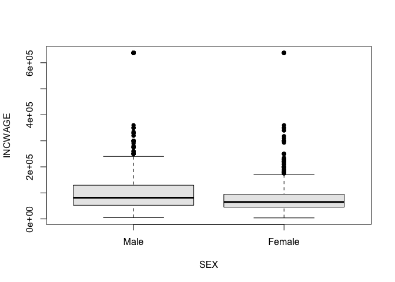

HW4
================
Author: Isabela Vieira

Collaborators: Christopher Tinevra, Akimawe Kadiri, Nicole Kerrison, Mostafa Ragheb, Charles Reed & Monica Martinez-Raga

Submission Date: 10/12/2020

Understanding the relationship between college degrees and wages.

First step is to determine what portion of the population I’m going to
select to conduct my analysis. Instead of conducting an analysis on the
correlation between degrees (HS, Bachelor, Master, etc.), I will be
conducting an analysis on the correlation between the degree field and
the income wage. As suggested in the lab, understanding which majors
open doors to higher paying jobs is an interesting analysis to conduct,
which is something that is not quite obvious to me. Given that, I want
to further restrict my population to individuals who have completed at
least 4 years of college, because I believe that’s the minimum time to
acquire a bachelor degree.

``` r
load("~/Documents/College/Fall 2020/Econometrics/acs2017_ny_data.RData")
attach(acs2017_ny)

#Since EDUC is a factor, we must convert it to a numeric variable we can use. 

EDUC_f <- factor(acs2017_ny$EDUC)
levels(EDUC_f) #In the last lab I didn't use this function, and my levels were a mess. I crosschecked this time and I have my numeric code perfectly tied to the txt codebook available for the PUMS dataset. 
```

    ##  [1] "N/A or no schooling"       "Nursery school to grade 4"
    ##  [3] "Grade 5, 6, 7, or 8"       "Grade 9"                  
    ##  [5] "Grade 10"                  "Grade 11"                 
    ##  [7] "Grade 12"                  "1 year of college"        
    ##  [9] "2 years of college"        "4 years of college"       
    ## [11] "5+ years of college"

``` r
EDUC_Code <-as.numeric(EDUC_f) #Creates a column with the numeric code for the categorical data. 

#Now, we are ready no insert a filter that will only select individuals with 4 & 5+ years of college. 
#Some inviduals may enter college earlier and complete their 4 to 5 years before 25, so I'll adjust that filter. I pretty much agree with the other filters chosen by default, so I'll leave them unchaged. 
use_varb <- (AGE >= 21) & (AGE <= 55) & (LABFORCE == 2) & (WKSWORK2 > 4) & (UHRSWORK >= 35) & (EDUC_Code >=10) & (CLASSWKR == 2)
dat_use <- subset(acs2017_ny,use_varb)  
attach(dat_use)
```

    ## The following objects are masked from acs2017_ny:
    ## 
    ##     AfAm, AGE, Amindian, ANCESTR1, ANCESTR1D, ANCESTR2, ANCESTR2D,
    ##     Asian, below_150poverty, below_200poverty, below_povertyline, BPL,
    ##     BPLD, BUILTYR2, CITIZEN, CLASSWKR, CLASSWKRD, Commute_bus,
    ##     Commute_car, Commute_other, Commute_rail, Commute_subway, COSTELEC,
    ##     COSTFUEL, COSTGAS, COSTWATR, DEGFIELD, DEGFIELD2, DEGFIELD2D,
    ##     DEGFIELDD, DEPARTS, EDUC, educ_advdeg, educ_college, educ_hs,
    ##     educ_nohs, educ_somecoll, EDUCD, EMPSTAT, EMPSTATD, FAMSIZE,
    ##     female, foodstamps, FOODSTMP, FTOTINC, FUELHEAT, GQ,
    ##     has_AnyHealthIns, has_PvtHealthIns, HCOVANY, HCOVPRIV, HHINCOME,
    ##     Hisp_Cuban, Hisp_DomR, Hisp_Mex, Hisp_PR, HISPAN, HISPAND,
    ##     Hispanic, in_Bronx, in_Brooklyn, in_Manhattan, in_Nassau, in_NYC,
    ##     in_Queens, in_StatenI, in_Westchester, INCTOT, INCWAGE, IND,
    ##     LABFORCE, LINGISOL, MARST, MIGCOUNTY1, MIGPLAC1, MIGPUMA1,
    ##     MIGRATE1, MIGRATE1D, MORTGAGE, NCHILD, NCHLT5, OCC, OWNCOST,
    ##     OWNERSHP, OWNERSHPD, POVERTY, PUMA, PWPUMA00, RACE, race_oth,
    ##     RACED, RELATE, RELATED, RENT, ROOMS, SCHOOL, SEX, SSMC, TRANTIME,
    ##     TRANWORK, UHRSWORK, UNITSSTR, unmarried, veteran, VETSTAT,
    ##     VETSTATD, white, WKSWORK2, YRSUSA1

Now adressing the question from the lab: “Consider what variables should
be in your model. What are some of the important factors that influence
a person’s wage? Is there a plausible causal link from X variables to Y
and not the reverse?”

For this question I’d like to bring some of the theorical stuff from the
class notes. So, to understand which one of these variables have a
greater correlation with income wage, I will run a covariance matrix. I
won’t be including variables related to education right now, because
I’ll do an analysis with those variables later in the homework. For
now, let’s just focus on age, race, gender, number of children, and
marital status.

Before anything, let’s create a function for normalizing the data
because we’ll need it.

``` r
norm_varb <- function(X_in) {
  (X_in - min(X_in, na.rm = TRUE))/( max(X_in, na.rm = TRUE) - min(X_in, na.rm = TRUE) )
}
```

Now, let’s fix the data before running the correlation

``` r
#Transform SEX into a numeric variable 
SEX_f <- factor(dat_use$SEX)
levels(SEX_f)
```

    ## [1] "Male"   "Female"

``` r
dat_use$SEX_Code <-as.numeric(SEX_f)
Sex.num <- as.numeric(SEX_f)

#Do the same for these variables 
NWage <- INCWAGE
nsex <- dat_use$SEX_Code
Nrace <- as.numeric(RACE)
Nnchild<- as.numeric(NCHILD)
nmarst <- as.numeric(MARST)

#Now lets normalize our data. We need to do this because our variables have very different ranges, which may affect comparability. 

Norm_Wage <- norm_varb(NWage)
Norm_Gender <- norm_varb(nsex)
Norm_Race <- norm_varb(Nrace)
Norm_Children <- norm_varb(Nnchild)
Norm_MaritalStatus <- norm_varb(nmarst)
Norm_Age <- norm_varb(AGE)
```

``` r
#Get a dataframe of the variables I'm interested in seeing the correlation with our dependent variable "INCWAGE"
df_1 <- data.frame(Norm_Wage, Norm_Gender, Norm_Race,Norm_Children, Norm_MaritalStatus, Norm_Age )

#Run the correlation, use "complete.obs" to exclude NAs (Altought I'm not sure if there are any NAs, but still did it just in case)
correlation_1 <- cor(df_1, use = "complete.obs")
print(correlation_1)
```

    ##                     Norm_Wage Norm_Gender   Norm_Race Norm_Children
    ## Norm_Wage           1.0000000 -0.18303180 -0.04791710    0.16601405
    ## Norm_Gender        -0.1830318  1.00000000  0.01640008   -0.05098547
    ## Norm_Race          -0.0479171  0.01640008  1.00000000   -0.04562532
    ## Norm_Children       0.1660140 -0.05098547 -0.04562532    1.00000000
    ## Norm_MaritalStatus -0.1925527  0.07073243  0.04255653   -0.51641898
    ## Norm_Age            0.2272201 -0.04627025 -0.05594718    0.34208027
    ##                    Norm_MaritalStatus    Norm_Age
    ## Norm_Wage                 -0.19255270  0.22722010
    ## Norm_Gender                0.07073243 -0.04627025
    ## Norm_Race                  0.04255653 -0.05594718
    ## Norm_Children             -0.51641898  0.34208027
    ## Norm_MaritalStatus         1.00000000 -0.42105927
    ## Norm_Age                  -0.42105927  1.00000000

Let’s recall what correlation means. Correlation Coefficient
Interpretation +1 Perfectly Correlated  
0 No Relationship -1 Perfectly Correlated (Inversely)

Surprisingly, the second greatest coeficient of correlation (|p|)
between these variables and our dependent variable, income wage, is the
marital status. In the text file, MARST has a range defined as 6 - not
married at all, and 1- married. Since we see a negative correlation, it
means that the greater the marital status, the lower the wage. Which
could possibly mean that separated (3) divorced (4) widowned (5) and
never maried (6) individuals are discriminated against. In this case
maybe being single (6) also involves a younger population, which would
make sense because we see a mild positive correlation between age and
income wage, meaning that the older you get, probably the more
experienced you get, and the higher is your wage.

However, for me that is pretty counterintuive, I’d expect married women,
for example, to be discriminated against more often because of their
likeability of having children. I’m glad I runned this, because I had an
awful misjudgement of whatever people discriminate against.

EXTREMELY SURPRISINGLY IS THAT THE NUMBER OF CHILDREN HAS A POSITIVE
CORRELATION WITH THE WAGE? I think it’s worth to see how many man are in
this population (dat\_use) that I selected.

``` r
summary(dat_use$SEX)
```

    ##   Male Female 
    ##  10724  11452

Ok, somehow we have more females in our selected dataset? And somehow
correlation is positive, I’m confused.

I want to see the correlation between wage and women with children.
Because in our covariance table we see that gender and wage are
inversely related, meaning that the higher your gender (1 = male, 2 =
female), the lower your wage. Which makes sense because women are
generally paid less according to my bias and now this has been confirmed
for NYC. However, why does having children increases your likeability of
having a greater wage? Maybe it could be that because NY is such an
expensive place to live, and having children is pretty expensive, it
could be that affluent people have more children because they can
afford. Another possible explanation is that couples wait until they’re
more mature to have children, and as we discussed before, that is
confirmed by the positive correlation we see between age and wage.

For the second part of the homework, I’ll be trying to see the
correlation between the wage and the field of degree. Which majors yield
higher wages?

First, let’s the grafic illustration of the distribution of detailed
degree fields.

``` r
#Here we can see wich group of majors are the most popular!
Major <- dat_use$DEGFIELD
plot(Major)
```

<!-- -->

``` r
#Now let's see how much is the degree field correlated to the income wage:
DEGFIELD_f <- factor(dat_use$DEGFIELD)
levels(DEGFIELD_f)
```

    ##  [1] "Agriculture"                                               
    ##  [2] "Environment and Natural Resources"                         
    ##  [3] "Architecture"                                              
    ##  [4] "Area, Ethnic, and Civilization Studies"                    
    ##  [5] "Communications"                                            
    ##  [6] "Communication Technologies"                                
    ##  [7] "Computer and Information Sciences"                         
    ##  [8] "Cosmetology Services and Culinary Arts"                    
    ##  [9] "Education Administration and Teaching"                     
    ## [10] "Engineering"                                               
    ## [11] "Engineering Technologies"                                  
    ## [12] "Linguistics and Foreign Languages"                         
    ## [13] "Family and Consumer Sciences"                              
    ## [14] "Law"                                                       
    ## [15] "English Language, Literature, and Composition"             
    ## [16] "Liberal Arts and Humanities"                               
    ## [17] "Library Science"                                           
    ## [18] "Biology and Life Sciences"                                 
    ## [19] "Mathematics and Statistics"                                
    ## [20] "Military Technologies"                                     
    ## [21] "Interdisciplinary and Multi-Disciplinary Studies (General)"
    ## [22] "Physical Fitness, Parks, Recreation, and Leisure"          
    ## [23] "Philosophy and Religious Studies"                          
    ## [24] "Theology and Religious Vocations"                          
    ## [25] "Physical Sciences"                                         
    ## [26] "Nuclear, Industrial Radiology, and Biological Technologies"
    ## [27] "Psychology"                                                
    ## [28] "Criminal Justice and Fire Protection"                      
    ## [29] "Public Affairs, Policy, and Social Work"                   
    ## [30] "Social Sciences"                                           
    ## [31] "Construction Services"                                     
    ## [32] "Electrical and Mechanic Repairs and Technologies"          
    ## [33] "Transportation Sciences and Technologies"                  
    ## [34] "Fine Arts"                                                 
    ## [35] "Medical and Health Sciences and Services"                  
    ## [36] "Business"                                                  
    ## [37] "History"

``` r
DEGFIELD_Code <-as.numeric(DEGFIELD_f)

#This line of code creates a aggregate table. We can see below the average wage by the degree field. 
Table1 <- tapply(INCWAGE, list(DEGFIELD_f), mean )
print(Table1)
```

    ##                                                Agriculture 
    ##                                                   73192.86 
    ##                          Environment and Natural Resources 
    ##                                                   73766.42 
    ##                                               Architecture 
    ##                                                  102861.68 
    ##                     Area, Ethnic, and Civilization Studies 
    ##                                                   87013.89 
    ##                                             Communications 
    ##                                                   83110.83 
    ##                                 Communication Technologies 
    ##                                                   97751.11 
    ##                          Computer and Information Sciences 
    ##                                                  106960.41 
    ##                     Cosmetology Services and Culinary Arts 
    ##                                                   46246.88 
    ##                      Education Administration and Teaching 
    ##                                                   70671.18 
    ##                                                Engineering 
    ##                                                  117493.56 
    ##                                   Engineering Technologies 
    ##                                                   77187.04 
    ##                          Linguistics and Foreign Languages 
    ##                                                  104713.62 
    ##                               Family and Consumer Sciences 
    ##                                                   70511.11 
    ##                                                        Law 
    ##                                                   81813.04 
    ##              English Language, Literature, and Composition 
    ##                                                   93094.95 
    ##                                Liberal Arts and Humanities 
    ##                                                   94116.03 
    ##                                            Library Science 
    ##                                                   54892.86 
    ##                                  Biology and Life Sciences 
    ##                                                  112523.81 
    ##                                 Mathematics and Statistics 
    ##                                                  123045.43 
    ##                                      Military Technologies 
    ##                                                  102250.00 
    ## Interdisciplinary and Multi-Disciplinary Studies (General) 
    ##                                                   99234.30 
    ##           Physical Fitness, Parks, Recreation, and Leisure 
    ##                                                   77716.18 
    ##                           Philosophy and Religious Studies 
    ##                                                   92556.04 
    ##                           Theology and Religious Vocations 
    ##                                                   67620.00 
    ##                                          Physical Sciences 
    ##                                                  102757.84 
    ## Nuclear, Industrial Radiology, and Biological Technologies 
    ##                                                  200175.00 
    ##                                                 Psychology 
    ##                                                   81837.84 
    ##                       Criminal Justice and Fire Protection 
    ##                                                   74699.79 
    ##                    Public Affairs, Policy, and Social Work 
    ##                                                   70245.83 
    ##                                            Social Sciences 
    ##                                                  122470.62 
    ##                                      Construction Services 
    ##                                                   62176.92 
    ##           Electrical and Mechanic Repairs and Technologies 
    ##                                                   71700.00 
    ##                   Transportation Sciences and Technologies 
    ##                                                   90183.33 
    ##                                                  Fine Arts 
    ##                                                   77449.18 
    ##                   Medical and Health Sciences and Services 
    ##                                                   85473.57 
    ##                                                   Business 
    ##                                                  106379.25 
    ##                                                    History 
    ##                                                  104785.69

``` r
#This creates a plot with labels that allows us to visualize which degree fields yield the highest income. Enlarge to see better. 
plot(Table1, main="INCWAGE vs. DEGFIELD",
   xlab="DEGFIELD", ylab="WAGE", pch=18, col="blue")
text(Table1, row.names(Table1), cex=0.6, pos=4, col="red")
```

<!-- -->

This output allows us to see which majors yield the highest wages, which
are “Physical Sciences Nuclear, Industrial Radiology, and Biological
Technologies” by far (as I would expect), “Mathematics and Statistics”,
“Social Sciences” (not on my bingo card), and “Egineering”. It would
be very useful to see the average cost of education for each major. For
example, I have this bias that getting a law degree is expensive, and
now that I see the mean wage for that degree field I have a feeling that
going for that is foolish.

Now, let’s run a linear regression for a very straighfoward variable such as gender just to see how it
works.

``` r
#I'll first run a simple model with only one variable to see if it returns something similar to our correlation results. 
model_temp1 <- lm(INCWAGE ~ SEX, data = dat_use)
summary(model_temp1)$coef
```

    ##              Estimate Std. Error   t value      Pr(>|t|)
    ## (Intercept) 115675.69    941.617 122.84792  0.000000e+00
    ## SEXFemale   -36326.45   1310.314 -27.72348 2.487325e-166

``` r
plot(model_temp1)
```

<!-- --><!-- --><!-- --><!-- -->

``` r
require(stargazer)
```

    ## Loading required package: stargazer

    ## 
    ## Please cite as:

    ##  Hlavac, Marek (2018). stargazer: Well-Formatted Regression and Summary Statistics Tables.

    ##  R package version 5.2.2. https://CRAN.R-project.org/package=stargazer

``` r
stargazer(model_temp1, type = "text")
```

    ## 
    ## ===============================================
    ##                         Dependent variable:    
    ##                     ---------------------------
    ##                               INCWAGE          
    ## -----------------------------------------------
    ## SEXFemale                 -36,326.460***       
    ##                             (1,310.314)        
    ##                                                
    ## Constant                  115,675.700***       
    ##                              (941.617)         
    ##                                                
    ## -----------------------------------------------
    ## Observations                  22,176           
    ## R2                             0.034           
    ## Adjusted R2                    0.033           
    ## Residual Std. Error   97,510.790 (df = 22174)  
    ## F Statistic         768.592*** (df = 1; 22174) 
    ## ===============================================
    ## Note:               *p<0.1; **p<0.05; ***p<0.01

``` r
#Stargazer makes it easier to interpret the P-value.
```

We see that the females earn $36,326 less than males on average. This
confirms the results we got from the covariance table, in which gender
and income wage are inversely correlated (if 2 - female, lower wage). We
know that often when the p-value is less than 0.05 (taking the usual 95%
confidence interval) we conclude that we have enought evidence to reject
the null hypothesis (that there is no relationship between the two
variables.) The stargazer function offers us a summary that shows the
p-value for this regression as beeing less than 0.01, which lead us to
conclude that there is a statistically significant difference between
the income wage of males and females.

Now let’s run that for the DEGFIELD and see what happens:

``` r
model_temp2 <- lm(INCWAGE ~ DEGFIELD, data = dat_use)
summary(model_temp2)$coef
```

    ##                                                                       Estimate
    ## (Intercept)                                                         73192.8571
    ## DEGFIELDEnvironment and Natural Resources                             573.5662
    ## DEGFIELDArchitecture                                                29668.8251
    ## DEGFIELDArea, Ethnic, and Civilization Studies                      13821.0317
    ## DEGFIELDCommunications                                               9917.9754
    ## DEGFIELDCommunication Technologies                                  24558.2540
    ## DEGFIELDComputer and Information Sciences                           33767.5528
    ## DEGFIELDCosmetology Services and Culinary Arts                     -26945.9821
    ## DEGFIELDEducation Administration and Teaching                       -2521.6743
    ## DEGFIELDEngineering                                                 44300.7076
    ## DEGFIELDEngineering Technologies                                     3994.1799
    ## DEGFIELDLinguistics and Foreign Languages                           31520.7579
    ## DEGFIELDFamily and Consumer Sciences                                -2681.7460
    ## DEGFIELDLaw                                                          8620.1863
    ## DEGFIELDEnglish Language, Literature, and Composition               19902.0936
    ## DEGFIELDLiberal Arts and Humanities                                 20923.1734
    ## DEGFIELDLibrary Science                                            -18300.0000
    ## DEGFIELDBiology and Life Sciences                                   39330.9524
    ## DEGFIELDMathematics and Statistics                                  49852.5706
    ## DEGFIELDMilitary Technologies                                       29057.1429
    ## DEGFIELDInterdisciplinary and Multi-Disciplinary Studies (General)  26041.4452
    ## DEGFIELDPhysical Fitness, Parks, Recreation, and Leisure             4523.3193
    ## DEGFIELDPhilosophy and Religious Studies                            19363.1868
    ## DEGFIELDTheology and Religious Vocations                            -5572.8571
    ## DEGFIELDPhysical Sciences                                           29564.9826
    ## DEGFIELDNuclear, Industrial Radiology, and Biological Technologies 126982.1429
    ## DEGFIELDPsychology                                                   8644.9787
    ## DEGFIELDCriminal Justice and Fire Protection                         1506.9305
    ## DEGFIELDPublic Affairs, Policy, and Social Work                     -2947.0238
    ## DEGFIELDSocial Sciences                                             49277.7679
    ## DEGFIELDConstruction Services                                      -11015.9341
    ## DEGFIELDElectrical and Mechanic Repairs and Technologies            -1492.8571
    ## DEGFIELDTransportation Sciences and Technologies                    16990.4762
    ## DEGFIELDFine Arts                                                    4256.3250
    ## DEGFIELDMedical and Health Sciences and Services                    12280.7138
    ## DEGFIELDBusiness                                                    33186.3914
    ## DEGFIELDHistory                                                     31592.8295
    ##                                                                    Std. Error
    ## (Intercept)                                                          11685.87
    ## DEGFIELDEnvironment and Natural Resources                            14364.34
    ## DEGFIELDArchitecture                                                 13462.11
    ## DEGFIELDArea, Ethnic, and Civilization Studies                       15002.34
    ## DEGFIELDCommunications                                               12046.47
    ## DEGFIELDCommunication Technologies                                   18681.15
    ## DEGFIELDComputer and Information Sciences                            12119.05
    ## DEGFIELDCosmetology Services and Culinary Arts                       20863.44
    ## DEGFIELDEducation Administration and Teaching                        11903.73
    ## DEGFIELDEngineering                                                  11977.95
    ## DEGFIELDEngineering Technologies                                     15002.34
    ## DEGFIELDLinguistics and Foreign Languages                            13469.90
    ## DEGFIELDFamily and Consumer Sciences                                 15268.16
    ## DEGFIELDLaw                                                          18557.14
    ## DEGFIELDEnglish Language, Literature, and Composition                12179.16
    ## DEGFIELDLiberal Arts and Humanities                                  13154.65
    ## DEGFIELDLibrary Science                                              28624.41
    ## DEGFIELDBiology and Life Sciences                                    12101.86
    ## DEGFIELDMathematics and Statistics                                   12835.79
    ## DEGFIELDMilitary Technologies                                        70115.20
    ## DEGFIELDInterdisciplinary and Multi-Disciplinary Studies (General)   13861.31
    ## DEGFIELDPhysical Fitness, Parks, Recreation, and Leisure             14382.19
    ## DEGFIELDPhilosophy and Religious Studies                             13750.72
    ## DEGFIELDTheology and Religious Vocations                             16248.54
    ## DEGFIELDPhysical Sciences                                            12377.93
    ## DEGFIELDNuclear, Industrial Radiology, and Biological Technologies   50262.81
    ## DEGFIELDPsychology                                                   11987.21
    ## DEGFIELDCriminal Justice and Fire Protection                         12524.17
    ## DEGFIELDPublic Affairs, Policy, and Social Work                      12845.60
    ## DEGFIELDSocial Sciences                                              11880.88
    ## DEGFIELDConstruction Services                                        22454.83
    ## DEGFIELDElectrical and Mechanic Repairs and Technologies             41590.30
    ## DEGFIELDTransportation Sciences and Technologies                     20052.23
    ## DEGFIELDFine Arts                                                    11997.31
    ## DEGFIELDMedical and Health Sciences and Services                     11957.76
    ## DEGFIELDBusiness                                                     11772.86
    ## DEGFIELDHistory                                                      12451.87
    ##                                                                        t value
    ## (Intercept)                                                         6.26336583
    ## DEGFIELDEnvironment and Natural Resources                           0.03992986
    ## DEGFIELDArchitecture                                                2.20387594
    ## DEGFIELDArea, Ethnic, and Civilization Studies                      0.92125831
    ## DEGFIELDCommunications                                              0.82330989
    ## DEGFIELDCommunication Technologies                                  1.31460083
    ## DEGFIELDComputer and Information Sciences                           2.78631975
    ## DEGFIELDCosmetology Services and Culinary Arts                     -1.29154041
    ## DEGFIELDEducation Administration and Teaching                      -0.21183899
    ## DEGFIELDEngineering                                                 3.69852045
    ## DEGFIELDEngineering Technologies                                    0.26623710
    ## DEGFIELDLinguistics and Foreign Languages                           2.34008867
    ## DEGFIELDFamily and Consumer Sciences                               -0.17564305
    ## DEGFIELDLaw                                                         0.46452132
    ## DEGFIELDEnglish Language, Literature, and Composition               1.63411104
    ## DEGFIELDLiberal Arts and Humanities                                 1.59055333
    ## DEGFIELDLibrary Science                                            -0.63931448
    ## DEGFIELDBiology and Life Sciences                                   3.24999151
    ## DEGFIELDMathematics and Statistics                                  3.88387130
    ## DEGFIELDMilitary Technologies                                       0.41442003
    ## DEGFIELDInterdisciplinary and Multi-Disciplinary Studies (General)  1.87871412
    ## DEGFIELDPhysical Fitness, Parks, Recreation, and Leisure            0.31450834
    ## DEGFIELDPhilosophy and Religious Studies                            1.40815784
    ## DEGFIELDTheology and Religious Vocations                           -0.34297591
    ## DEGFIELDPhysical Sciences                                           2.38852460
    ## DEGFIELDNuclear, Industrial Radiology, and Biological Technologies  2.52636366
    ## DEGFIELDPsychology                                                  0.72118361
    ## DEGFIELDCriminal Justice and Fire Protection                        0.12032175
    ## DEGFIELDPublic Affairs, Policy, and Social Work                    -0.22941898
    ## DEGFIELDSocial Sciences                                             4.14765422
    ## DEGFIELDConstruction Services                                      -0.49058184
    ## DEGFIELDElectrical and Mechanic Repairs and Technologies           -0.03589436
    ## DEGFIELDTransportation Sciences and Technologies                    0.84731120
    ## DEGFIELDFine Arts                                                   0.35477336
    ## DEGFIELDMedical and Health Sciences and Services                    1.02700809
    ## DEGFIELDBusiness                                                    2.81888892
    ## DEGFIELDHistory                                                     2.53719486
    ##                                                                        Pr(>|t|)
    ## (Intercept)                                                        3.836881e-10
    ## DEGFIELDEnvironment and Natural Resources                          9.681494e-01
    ## DEGFIELDArchitecture                                               2.754332e-02
    ## DEGFIELDArea, Ethnic, and Civilization Studies                     3.569256e-01
    ## DEGFIELDCommunications                                             4.103407e-01
    ## DEGFIELDCommunication Technologies                                 1.886577e-01
    ## DEGFIELDComputer and Information Sciences                          5.335562e-03
    ## DEGFIELDCosmetology Services and Culinary Arts                     1.965298e-01
    ## DEGFIELDEducation Administration and Teaching                      8.322346e-01
    ## DEGFIELDEngineering                                                2.173840e-04
    ## DEGFIELDEngineering Technologies                                   7.900591e-01
    ## DEGFIELDLinguistics and Foreign Languages                          1.928800e-02
    ## DEGFIELDFamily and Consumer Sciences                               8.605760e-01
    ## DEGFIELDLaw                                                        6.422789e-01
    ## DEGFIELDEnglish Language, Literature, and Composition              1.022498e-01
    ## DEGFIELDLiberal Arts and Humanities                                1.117244e-01
    ## DEGFIELDLibrary Science                                            5.226250e-01
    ## DEGFIELDBiology and Life Sciences                                  1.155807e-03
    ## DEGFIELDMathematics and Statistics                                 1.031051e-04
    ## DEGFIELDMilitary Technologies                                      6.785705e-01
    ## DEGFIELDInterdisciplinary and Multi-Disciplinary Studies (General) 6.029667e-02
    ## DEGFIELDPhysical Fitness, Parks, Recreation, and Leisure           7.531379e-01
    ## DEGFIELDPhilosophy and Religious Studies                           1.590984e-01
    ## DEGFIELDTheology and Religious Vocations                           7.316198e-01
    ## DEGFIELDPhysical Sciences                                          1.692450e-02
    ## DEGFIELDNuclear, Industrial Radiology, and Biological Technologies 1.153192e-02
    ## DEGFIELDPsychology                                                 4.708042e-01
    ## DEGFIELDCriminal Justice and Fire Protection                       9.042294e-01
    ## DEGFIELDPublic Affairs, Policy, and Social Work                    8.185454e-01
    ## DEGFIELDSocial Sciences                                            3.371514e-05
    ## DEGFIELDConstruction Services                                      6.237271e-01
    ## DEGFIELDElectrical and Mechanic Repairs and Technologies           9.713669e-01
    ## DEGFIELDTransportation Sciences and Technologies                   3.968308e-01
    ## DEGFIELDFine Arts                                                  7.227628e-01
    ## DEGFIELDMedical and Health Sciences and Services                   3.044279e-01
    ## DEGFIELDBusiness                                                   4.823295e-03
    ## DEGFIELDHistory                                                    1.118128e-02

``` r
plot(model_temp2)
```

<!-- --><!-- --><!-- --><!-- -->

``` r
require(stargazer)
stargazer(model_temp2, type = "text")
```

    ## 
    ## ==============================================================================================
    ##                                                                        Dependent variable:    
    ##                                                                    ---------------------------
    ##                                                                              INCWAGE          
    ## ----------------------------------------------------------------------------------------------
    ## DEGFIELDEnvironment and Natural Resources                                    573.566          
    ##                                                                           (14,364.340)        
    ##                                                                                               
    ## DEGFIELDArchitecture                                                      29,668.830**        
    ##                                                                           (13,462.110)        
    ##                                                                                               
    ## DEGFIELDArea, Ethnic, and Civilization Studies                             13,821.030         
    ##                                                                           (15,002.340)        
    ##                                                                                               
    ## DEGFIELDCommunications                                                      9,917.975         
    ##                                                                           (12,046.470)        
    ##                                                                                               
    ## DEGFIELDCommunication Technologies                                         24,558.250         
    ##                                                                           (18,681.150)        
    ##                                                                                               
    ## DEGFIELDComputer and Information Sciences                                 33,767.550***       
    ##                                                                           (12,119.050)        
    ##                                                                                               
    ## DEGFIELDCosmetology Services and Culinary Arts                             -26,945.980        
    ##                                                                           (20,863.440)        
    ##                                                                                               
    ## DEGFIELDEducation Administration and Teaching                              -2,521.674         
    ##                                                                           (11,903.730)        
    ##                                                                                               
    ## DEGFIELDEngineering                                                       44,300.710***       
    ##                                                                           (11,977.950)        
    ##                                                                                               
    ## DEGFIELDEngineering Technologies                                            3,994.180         
    ##                                                                           (15,002.340)        
    ##                                                                                               
    ## DEGFIELDLinguistics and Foreign Languages                                 31,520.760**        
    ##                                                                           (13,469.900)        
    ##                                                                                               
    ## DEGFIELDFamily and Consumer Sciences                                       -2,681.746         
    ##                                                                           (15,268.160)        
    ##                                                                                               
    ## DEGFIELDLaw                                                                 8,620.186         
    ##                                                                           (18,557.140)        
    ##                                                                                               
    ## DEGFIELDEnglish Language, Literature, and Composition                      19,902.090         
    ##                                                                           (12,179.160)        
    ##                                                                                               
    ## DEGFIELDLiberal Arts and Humanities                                        20,923.170         
    ##                                                                           (13,154.650)        
    ##                                                                                               
    ## DEGFIELDLibrary Science                                                    -18,300.000        
    ##                                                                           (28,624.410)        
    ##                                                                                               
    ## DEGFIELDBiology and Life Sciences                                         39,330.950***       
    ##                                                                           (12,101.860)        
    ##                                                                                               
    ## DEGFIELDMathematics and Statistics                                        49,852.570***       
    ##                                                                           (12,835.790)        
    ##                                                                                               
    ## DEGFIELDMilitary Technologies                                              29,057.140         
    ##                                                                           (70,115.200)        
    ##                                                                                               
    ## DEGFIELDInterdisciplinary and Multi-Disciplinary Studies (General)         26,041.440*        
    ##                                                                           (13,861.310)        
    ##                                                                                               
    ## DEGFIELDPhysical Fitness, Parks, Recreation, and Leisure                    4,523.319         
    ##                                                                           (14,382.190)        
    ##                                                                                               
    ## DEGFIELDPhilosophy and Religious Studies                                   19,363.190         
    ##                                                                           (13,750.720)        
    ##                                                                                               
    ## DEGFIELDTheology and Religious Vocations                                   -5,572.857         
    ##                                                                           (16,248.540)        
    ##                                                                                               
    ## DEGFIELDPhysical Sciences                                                 29,564.980**        
    ##                                                                           (12,377.930)        
    ##                                                                                               
    ## DEGFIELDNuclear, Industrial Radiology, and Biological Technologies        126,982.100**       
    ##                                                                           (50,262.810)        
    ##                                                                                               
    ## DEGFIELDPsychology                                                          8,644.979         
    ##                                                                           (11,987.210)        
    ##                                                                                               
    ## DEGFIELDCriminal Justice and Fire Protection                                1,506.931         
    ##                                                                           (12,524.170)        
    ##                                                                                               
    ## DEGFIELDPublic Affairs, Policy, and Social Work                            -2,947.024         
    ##                                                                           (12,845.600)        
    ##                                                                                               
    ## DEGFIELDSocial Sciences                                                   49,277.770***       
    ##                                                                           (11,880.880)        
    ##                                                                                               
    ## DEGFIELDConstruction Services                                              -11,015.930        
    ##                                                                           (22,454.830)        
    ##                                                                                               
    ## DEGFIELDElectrical and Mechanic Repairs and Technologies                   -1,492.857         
    ##                                                                           (41,590.300)        
    ##                                                                                               
    ## DEGFIELDTransportation Sciences and Technologies                           16,990.480         
    ##                                                                           (20,052.230)        
    ##                                                                                               
    ## DEGFIELDFine Arts                                                           4,256.325         
    ##                                                                           (11,997.310)        
    ##                                                                                               
    ## DEGFIELDMedical and Health Sciences and Services                           12,280.710         
    ##                                                                           (11,957.760)        
    ##                                                                                               
    ## DEGFIELDBusiness                                                          33,186.390***       
    ##                                                                           (11,772.860)        
    ##                                                                                               
    ## DEGFIELDHistory                                                           31,592.830**        
    ##                                                                           (12,451.870)        
    ##                                                                                               
    ## Constant                                                                  73,192.860***       
    ##                                                                           (11,685.870)        
    ##                                                                                               
    ## ----------------------------------------------------------------------------------------------
    ## Observations                                                                 22,176           
    ## R2                                                                            0.030           
    ## Adjusted R2                                                                   0.028           
    ## Residual Std. Error                                                  97,770.970 (df = 22139)  
    ## F Statistic                                                        18.935*** (df = 36; 22139) 
    ## ==============================================================================================
    ## Note:                                                              *p<0.1; **p<0.05; ***p<0.01

For the degree field we see that R took “Agriculture” as the intercept
and the other 36 levels as dummy variables. According to our aggregate
table, the average salary for Agriculture majors is the same as the
intercept estimate value returned by the linear model. So we know this
is working correctly. Now, since there are 37 different “options” in
this regression (there are 37 levels within the DEGFIELD factor), it’s a
little harder for me to interpret the results. Some of the majors
present a statistically significant difference from the intercept
(agriculture), while others don’t (See the \* in each of the levels). I
don’t really understand what does that mean.

I have never heard of F-statistic before, but after looking it up I
found this “The F-statistic is simply a ratio of two variances.
Variances are a measure of dispersion, or how far the data are scattered
from the mean. Larger values represent greater dispersion.” So I guess
that for this regression R took the Agriculture salary as the “mean” for
the DEGFIELD factor. So I guess that each major differs from the
agricultural wages by a certain amount, and the F-test is a summary of
all those differences. Given the F-statistic 18.935\*\*\* (df = 36;
22139) we got from this regression, we can say that there is a
statistically significant relationship between the degree field and the
income wage of an individual, since \*\*\* means P\< 0.01. I think this
is an easier way to find and interpret relationships between variables,
because when I saw the correlation between DEGFIELD and INCWAGE I
thought it was not thar significant:

``` r
correlation_3 <- cor(DEGFIELD_Code, INCWAGE, use = "complete.obs")
print(correlation_3)
```

    ## [1] 0.03361157

``` r
#But also the function cor can only support numerical variables, and since the degree field is not an ordered variable it wouldn't make much sence to run this as numeric. It doesn't really tell me anything. So it's pretty obvious that lm works much better to work with categorical data. 
```

Ok I really don’t know what’s going on with the graphs though. Now let’s
try to plot a linear model in the way Kevin wants:

``` r
# subset in order to plot... I don't understand why we do that. 
NNobs <- length(INCWAGE)
set.seed(12345) # just so you can replicate and get same "random" choices
graph_obs <- (runif(NNobs) < 0.1) # "so something like just 1/10 as many obs" ## Why do we do this?
dat_graph <-subset(dat_use,graph_obs)  

plot(INCWAGE ~ SEX, pch = 16, col = rgb(0.5, 0.5, 0.5, alpha = 0.2), data = dat_graph)
```

<!-- -->

``` r
# ^^ that looks like crap since Wages are soooooooo skew!  So try to find some sensible ylim = c(0, ??)
plot(INCWAGE ~ SEX, pch = 16, col = rgb(0.5, 0.5, 0.5, alpha = 0.2), ylim = c(0,150000), data = dat_graph) #WHAT IS YLIM???
```

<!-- -->

``` r
# discus what you see in this plot: Ok in this plot we can see the same info that I've stated before, but here it's easier to visualize how the income wage between men and women differ by mean, max, and min, which is cool. I really have no clue how we could plot DEGFIELD using this code. 
# I understand the the Jitter function was supposed to remove any "noise" from the data, but it really only works with numerical values.

plot(INCWAGE ~ DEGFIELD, pch = 16, col = rgb(0.5, 0.5, 0.5, alpha = 0.2), ylim = c(0,150000), data = dat_graph) #Really terrible visuals. I have no idea how to interpret this.  
```

<!-- -->

Let’s try something completely different for the last part of the lab.
Let’s try to see how the number of children a woman has can affect the
total income of that woman.

``` r
model_temp3 <- lm(INCTOT ~ NCHILD, data = dat_use)
summary(model_temp3)$coef
```

    ##             Estimate Std. Error  t value      Pr(>|t|)
    ## (Intercept) 86363.74   872.4103 98.99441  0.000000e+00
    ## NCHILD      16068.17   637.1337 25.21946 2.182973e-138

``` r
plot(model_temp3)
```

<!-- --><!-- --><!-- --><!-- -->

``` r
require(stargazer)
stargazer(model_temp3, type = "text")
```

    ## 
    ## ===============================================
    ##                         Dependent variable:    
    ##                     ---------------------------
    ##                               INCTOT           
    ## -----------------------------------------------
    ## NCHILD                     16,068.170***       
    ##                              (637.134)         
    ##                                                
    ## Constant                   86,363.740***       
    ##                              (872.410)         
    ##                                                
    ## -----------------------------------------------
    ## Observations                  22,176           
    ## R2                             0.028           
    ## Adjusted R2                    0.028           
    ## Residual Std. Error  103,308.300 (df = 22174)  
    ## F Statistic         636.021*** (df = 1; 22174) 
    ## ===============================================
    ## Note:               *p<0.1; **p<0.05; ***p<0.01

``` r
# subset in order to plot...
NNobs <- length(INCTOT)
set.seed(12345) # just so you can replicate and get same "random" choices
graph_obs <- (runif(NNobs) < 0.1) # so something like just 1/10 as many obs
dat_graph <-subset(dat_use,graph_obs)  

#Let's try to do something else with this. Let's try to see how the number of children affect the total income for example. 

plot(INCTOT ~ jitter(NCHILD, factor = 2), pch = 16, col = rgb(0.5, 0.5, 0.5, alpha = 0.2), data = dat_graph)
```

<!-- -->

``` r
# ^^ that looks like crap since Wages are soooooooo skew!  So try to find some sensible ylim = c(0, ??)
plot(INCTOT ~ jitter(NCHILD, factor = 2), pch = 16, col = rgb(0.5, 0.5, 0.5, alpha = 0.2), ylim = c(0,150000), data = dat_graph)
# discus what you see in this plot

# Let's see if we can predict the total income given the number of child a woman has 
to_be_predicted3 <- data.frame(INCTOT, female = 1)
to_be_predicted3$yhat <- predict(model_temp3, newdata = to_be_predicted3)

lines(yhat ~ NCHILD, data = to_be_predicted3)
```

<!-- --> On the graph,
we see that there is a statistically significant relationship between
the number of children and the total income of a woman (since p-value \<
0.01). Again, this is highly surprising to me, but we have discussed
that earlier in the lab. Maybe the higher the income for a person, the
greater the likeability that person will have more children just because
they can afford it. This completely proves wrong the bias that poor
people have more children. We do see some RARE cases (the very outliers
in the graph) of women that have between 5 and 8 children with an income
that is below 100,000. Nevertheless, having 5-8 kids nowadays is rare
for other reasons. I’m really intrigued by this actually. I remember
studying in economic development that women with higher levels of
education, and thus higher wages, would avoid having more children
because of a higher opportunity cost. It’s funny to see that the data
shows something different. Nevertheless, NYS is a very developed and
somewhat rich area if we are to compare it to developing countries in
which a great part of the population works in agriculture and do see
having children as a means to split labor.

``` r
detach(dat_use)
```
